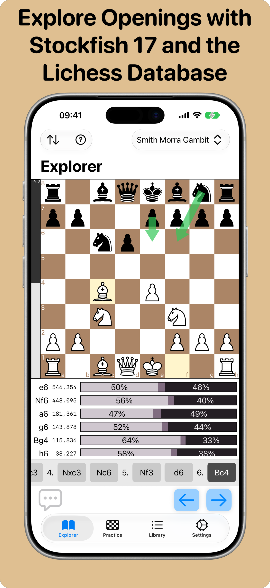
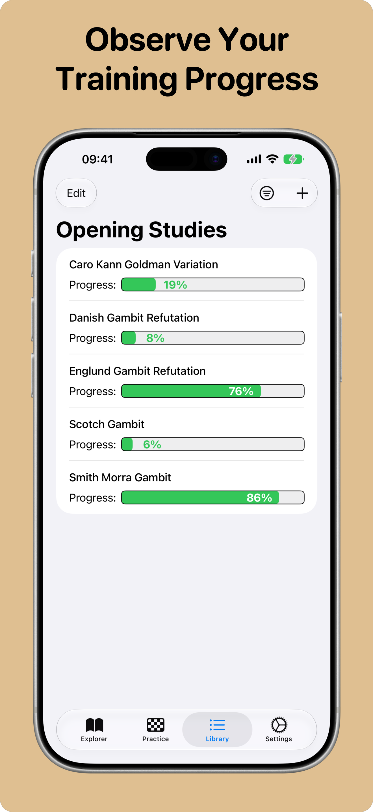
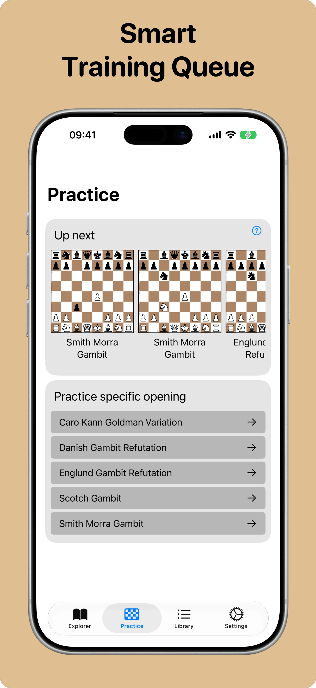
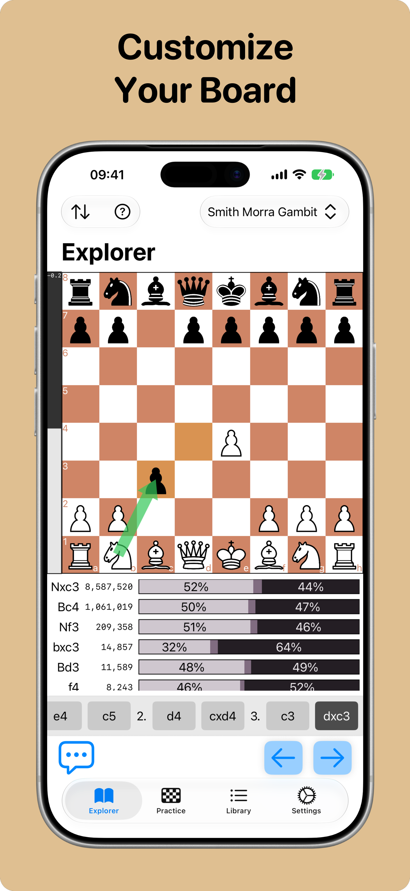

<a href="README.de.md">🇩🇪 Deutsch</a>

  

<h1 align="center">OpeningsMastermind</h1>

<strong>Learn chess openings the way you actually play them.</strong>

  

OpeningsMastermind is an iOS app for studying chess openings. Import any opening
as a PGN file or [Lichess study](https://lichess.org/study), explore it on a fully
interactive board, get instant engine evaluation, see how the pros play each move,
and lock the lines into memory with spaced-repetition practice.

  
  
  
  

## Features

- **Explore** — Step through your openings on an interactive board with a live
  Stockfish evaluation bar and best-move hints.
- **Opening explorer** — See real-game move frequencies and win rates straight
  from the Lichess opening explorer.
- **Practice** — Drill your repertoire with built-in spaced repetition that
  schedules reviews based on how well you know each line.
- **Import anything** — Paste raw PGN, pull in a Lichess study by URL, or start
  from the bundled example studies.
- **Make it yours** — Customize board colors and piece style, choose your move
  animation speed, and switch between English and German.
- **Private by design** — Analytics and crash reporting are fully optional and
  can be turned off in Settings.

## What's new in v0.9

- Refreshed interface built around Apple's new **Liquid Glass** design
- **German language support** — switch in Settings → General
- More reliable PGN import: a rewritten parser handles a much wider range of
  Lichess studies and PGN files correctly
- Fixed crashes on very deep or repetitive opening lines
- Fixed a rare crash related to the chess engine
- New privacy controls: opt in or out of analytics and crash reports in Settings
- Various stability and performance improvements

## Requirements

- **iOS 18.6** or later
- **iPhone and iPad** (universal app)

## Building from source

Want to build the app yourself? See [`BUILDING.md`](BUILDING.md) for the full
setup, including the one-time [`Scripts/download_nnue.sh`](Scripts/download_nnue.sh)
step that fetches Stockfish's neural network files (they aren't committed to the
repo).

## Why this repository is public

OpeningsMastermind bundles **[Stockfish](https://stockfishchess.org/)** (via
[ChessKitEngine](https://github.com/chesskit-app/chesskit-engine)), which is
licensed under the **GNU General Public License v3**. Distributing the app
therefore obligates us to offer the complete corresponding source, and this
repository is that source. As a consequence, the entire app is released under
the GPLv3.

## License

Copyright © Christian Heise.

Licensed under the GNU General Public License v3.0 or later. See [`LICENSE`](LICENSE)
for the full text.
